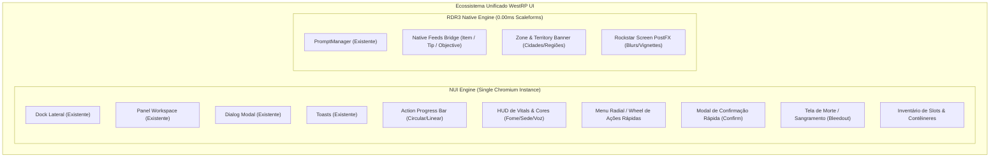

# Mapeamento Arquitetural de Componentes de UI — WestRP Framework
> **Padrão:** Spec-Driven Development (SDD)  
> **Target:** RedM (CitizenFX RDR3 - Game Build 1491+)  
> **Objetivo:** Ecossistema de Interface Completo, Otimizado para Alta Densidade de Jogadores (100–256 slots) e 100% Imersivo  

---

## 1. Diagnóstico do Estado Atual (`westrp_ui` & `westrp_core`)

O WestRP já estabeleceu uma fundação sólida e superior ao padrão comum de RedM, estruturada em:

| Componente Atual | Arquitetura | Características Principais | Status |
| :--- | :--- | :--- | :---: |
| **Dock Lateral (350px)** | NUI Data-Driven | Navegação por teclado/mouse, abas horizontais, controles (`button`, `toggle`, `slider`, `submenu`), câmera livre (`keepInput`), áudio procedural Web Audio API. | ✅ Operacional |
| **Panel Workspace (1040x660px)** | NUI Central / Cursor | 6 Modos (`grid`, `table`, `craft`, `queue`, `dashboard`, `settings`), busca textual, chips de filtro, paginação dinâmica e desfoque nativo `OJDominoBlur`. | ✅ Operacional |
| **Modal de Diálogos (`OpenDialog`)** | NUI Modal Form | Inputs tipados (`text`, `number`, `select`, `textarea`), validações DOM nativas e callbacks assíncronos. | ✅ Operacional |
| **Toasts de Notificação (`ShowToast`)** | NUI Overlay | 4 tipos (`info`, `success`, `alert`, `error`), temporizador e animação de deslize. | ✅ Operacional |
| **Repositório de Assets (`westrp_assets`)** | Mídia Estática NUI | 2.122 ícones catalogados em 34 categorias com resolução automática por `index.json`. | ✅ Operacional |
| **World Prompt Manager (`PromptManager`)** | RDR3 C++ Engine | Encapsulamento das nativas de prompt (`UiPromptRegisterBegin`, `UiPromptSetControlAction`), 0.00ms em idle. | ✅ Operacional |

---

## 2. Benchmark e Análise Crítica: VORP Core vs. Base Cfx ([system])

### 2.1 O Modelo Fragmentado do VORP Core
Ao analisar `[VORP]` (`vorp_core/ui`, `vorp_progressbar`, `vorp_inputs`, `vorp_metabolism`, `vorp_zonenotify`, `vorp_inventory`):
1. **Proliferação de Instâncias Chromium (CEF Bloat):** Cada recurso VORP instancia seu próprio `ui_page` com HTML, CSS e bibliotecas JavaScript separadas (Vue 2 no core, jQuery no progressbar, scripts avulsos no inputs). Em servidores cheios, múltiplos contextos CEF concorrentes disputam VRAM e geram micro-travamentos (*frame drops*) ao alternar focos de mouse.
2. **Uso Misto e Desordenado de Nativas:** Em `[VORP]/vorp_core/client/ref/vorp_notifications.lua`, o VORP recorre a ponteiros brutos de memória (`DataView.ArrayBuffer(8 * 7)` e hashes de 64 bits em chamadas `Citizen.InvokeNative`) para notificações nativas. Isso é eficiente em termos de renderização pelo motor da Rockstar, mas extremamente frágil e complexo para desenvolvedores de scripts comuns utilizarem diretamente.
3. **Foco Destrutivo (`SetNuiFocus` Desbalanceado):** Scripts como `vorp_progressbar` capturam foco sem controle estrito, correndo o risco de congelar controles de jogadores caso a animação seja interrompida abruptamente.

### 2.2 O Modelo Cfx Base ([system])
A camada `[system]` (`baseevents`, `runcode`, `sessionmanager-rdr3`):
* Utiliza eventos padronizados (`CEventNetworkEntityDamage`, eventos de sessão e estado).
* Evita loops desnecessários e prioriza o **desacoplamento orientado a eventos** (Event-Driven Architecture).

### 2.3 A Filosofia Híbrida do WestRP (A Solução Definitiva)
Para atingir o ápice de performance em servidores massivos:
* **CEF Único e Centralizado (`westrp_ui`):** Todas as telas complexas, formulários, grids e HUDs convivem dentro de **uma única página Chromium**.
* **Ponte de Nativas do RDR2 (`WestRP.Client.Feed`):** Alertas simples de inventário, objetivos e banners territoriais utilizam as nativas do próprio jogo (Scaleform/Feed), garantindo **0.00ms de resmon** e fidelidade estética genuína de RDR2.

---

## 3. Matriz de Componentes Faltantes para uma UI Completa

Para que o `westrp` possa suportar os primeiros recursos de gameplay (Economia, Caça, Medicina, Polícia/Xerife, Inventário, Sobrevivência, Emotes e Propriedades), os seguintes componentes ainda precisam ser integrados:

---

### Detalhamento dos Componentes a Construir

### 🟢 GRUPO 1: Micro-Interações & Resposta de Ações (Imediato)

#### 1. Action Progress Bar (`WestRP.Client.UI.ProgressBar`)
* **Propósito:** Indicar progresso temporal de ações mecânicas no mundo (coletar ervas, esfolar carcaças, amarrar suspeito, curar ferimentos, forjar lâmina, gazuar portas).
* **Arquitetura:** Componente NUI leve no `westrp_ui` (linear ou circular no estilo de tinta de jornal/marchetaria) ou Scaleform nativo.
* **Comportamento Chave:**
  * Cancelamento automático caso o jogador se mova, sofra dano ou pressione tecla de abortar.
  * Callback `onComplete` e `onCancel`.
  * Efeito sonoro procedural no início e na conclusão.
  * **Zero foco de cursor** (`SetNuiFocus(false, false)`), mantendo o jogador imerso na cena.

#### 2. Modal de Confirmação Rápida (`WestRP.Client.UI.OpenConfirm`)
* **Propósito:** Validação de intenção binária (Sim/Não) para ações de impacto irreversível ou financeiro (excluir personagem, comprar cavalo caro, pagar fiança, demitir funcionário).
* **Vantagem:** Muito mais direto e rápido de invocar que um formulário dinâmico `OpenDialog`.

---

### 🟡 GRUPO 2: HUD Contínuo & Sobrevivência (Roleplay Base)

#### 3. Cores & Vitals HUD (Status de Sobrevivência & Condição Física)
* **Propósito:** Exibir a condição biológica do personagem no mundo.
* **Métricas Integradas:**
  * Fome (*Hunger*), Sede (*Thirst*), Temperatura corporal, Nível de Estresse/Sanidade e Karma.
* **Diretrizes de Performance Extrema:**
  * **Zero Envio por Frame:** Não enviar `SendNUIMessage` em `Wait(0)`. A sincronização de dados deve ocorrer por **mudança de estado (deltas)** ou em lote com intervalo adaptativo (ex: a cada 1.000ms a 2.000ms).
  * **Transições Suaves em CSS:** Interpolação visual no front-end (`transition: stroke-dashoffset 0.4s ease`).
  * **Modo Cinemático (Auto-Hide):** Ocultação automática quando o jogador estiver mirando com armas, usando lunetas, em cutscenes cinematográficas ou através de comando (`/hud`) / tecla de visualização rápida (`Alt` / `Z`).

#### 4. Voice, Identity & Economy Widget
* **Propósito:** Integrar a interface ao sistema de áudio direcional (ex: PMA-Voice) e identificação de personagem.
* **Indicadores:**
  * Modo de alcance da voz: *Sussurro* (1m), *Normal* (5m), *Grito* (15m).
  * Onda sonora ativa quando o jogador fala no microfone.
  * ID do cidadão e carteira compacta no canto superior ($ / Gold).

---

### 🔵 GRUPO 3: Menus Dinâmicos & Ambientação Rockstar

#### 5. Menu Radial / Wheel Menu de Ações Rápidas (`WestRP.Client.UI.OpenRadial`)
* **Propósito:** Menu circular de acesso rápido sem necessidade de digitar comandos ou abrir docks pesados.
* **Casos de Uso:**
  * Menu de Emotes e Animações Rápidas.
  * Ações com o Cavalo (alimentar, escovar, selar, mandar embora).
  * Interações com Veículos / Carroças.
  * Ações com Prisioneiros (revistar, vendar, carregar, colocar na cela).
* **Características:**
  * 6 a 8 setores angulares, suporte a submenus (sub-rodas).
  * Navegação por cursor ou ângulo de analógico (controle).
  * Resolução automática de ícones via `westrp_assets`.

#### 6. Native Feeds & RDR2 Ticker Bridge (`WestRP.Client.Feed`)
* **Propósito:** Uma fachada amigável em Lua para acionar os feeds nativos da Rockstar sem que o desenvolvedor precise lidar com structs ou ponteiros de memória de baixo nível.
* **Sub-tipos:**
  * `Feed.ItemReceived(itemId, count, label)`: Exibe o card nativo no canto superior direito com o ícone original do RDR2.
  * `Feed.Tip(message, duration)`: Dica contextual de jogo.
  * `Feed.Objective(message)`: Texto amarelo de instrução na base da tela.
  * `Feed.ShardAlert(title, subtitle, soundType)`: Faixa preta com tipografia nativa e som de impacto.
* **Custo de CPU/GPU:** **0.00ms** (Renderizado diretamente pela engine C++ da Rockstar).

#### 7. Zone & Territory Banner (Aviso de Cidades & Distritos)
* **Propósito:** Exibir a icônica vinheta de entrada em novos territórios ("VALENTINE — THE HEARTLANDS, NEW HANOVER").
* **Opções Técnicas:** Scaleform nativo do RDR3 ou animação CSS refinada no `westrp_ui`.

---

### 🔴 GRUPO 4: Estados Críticos & Comunicação

#### 8. Tela de Inconsciência & Sangramento (Bleedout / Coma Screen)
* **Propósito:** Exibição imersiva quando a vida do jogador chega a zero.
* **Elementos:**
  * Pós-processamento visual nativo de tela (`DeathFailMP01` ou vinheta avermelhada).
  * Pulsação sonora de batimentos cardíacos lentos (Web Audio API).
  * Cronômetro de coma / sangramento (ex: 300 segundos para sangrar até a morte).
  * Ações contextuais por teclas: [G] Solicitar Socorro Médico (dispara alerta para a equipe médica no mapa) e [E] Desistir / Respawn (liberado após o timer expirar).

#### 9. Chat de Texto RP & Histórico de Comandos
* **Propósito:** Canal de comunicação textual no padrão Western (pergaminho/couro).
* **Canais:** Local (proximidade), `/me` (ações físicas), `/do` (cenário), `/ooc` (fora do personagem), `/g` (grito), `/s` (sussurro).
* **Performance:** Renderização sem reflows no DOM, limite de linhas com descarte automático de mensagens antigas.

---

### 🟣 GRUPO 5: Interfaces Nucleares de Gameplay (Grandes Módulos)

#### 10. Inventário de Slots & Contêineres (Satchel / Baús / Cavalo)
* **Propósito:** Gestão de itens em grid com arrastar e soltar (drag-and-drop).
* **Visões:** Bolsas pessoais, alforjes de cavalos, baús de residências, porta-malas de carroças e itens no chão.
* **Métricas:** Limites de peso / volume por contêiner, separação de pilhas (*split stack*), durabilidade e metadados de itens.

#### 11. Seletor & Criador de Personagens (Identidade & Costureiro/Barbeiro)
* **Propósito:** Boas-vindas ao servidor e customização visual.
* **Visão de Seleção:** Cartazes de procurado ou passaportes sobre mesa de carvalho.
* **Visão de Customização:** Ajustes de morfologia facial, tons de pele, cicatrizes, cabelos e vestimentas com controle dinâmico de câmera.

---

## 4. Matriz de Priorização Técnica (Roadmap de Execução)

Para maximizar a produtividade e permitir que os primeiros resources de gameplay sejam criados imediatamente, organizamos a entrega nas seguintes ondas:

| Onda | Componente | Justificativa | Esforço |
| :---: | :--- | :--- | :---: |
| **Onda 1 (Imediata)** | **Action Progress Bar** | Pré-requisito para qualquer mecânica de interação no mundo (colheita, forja, arrombamento, cura). | 1 a 2 horas |
| **Onda 1 (Imediata)** | **Modal de Confirmação (`OpenConfirm`)** | Necessário para validações de compra/venda e ações destrutivas. | 30 minutos |
| **Onda 1 (Imediata)** | **Native Feeds Bridge (`WestRP.Client.Feed`)** | Fornece notificações 100% nativas (0.00ms) para ganhos de itens e dicas de jogo. | 1 hora |
| **Onda 2 (Sobrevivência)** | **HUD de Vitals & Cores (Fome/Sede/Voz)** | Sustenta o loop básico de sobrevivência e integração com chat de voz. | 2 a 3 horas |
| **Onda 2 (Sobrevivência)** | **Menu Radial de Ações Rápidas** | Centraliza comandos de emotes, cavalo e interações sem poluir o teclado de binds. | 2 a 3 horas |
| **Onda 3 (Estados Críticos)** | **Tela de Morte / Sangramento (Bleedout)** | Fecha o ciclo de combate, ferimentos e atendimento médico do servidor. | 2 horas |
| **Onda 3 (Estados Críticos)** | **Zone Banner (Cidades & Distritos)** | Consolida a identidade imersiva de fronteira ao cavalgar pelo mapa. | 1 hora |
| **Onda 4 (Grandes Módulos)** | **Inventário de Slots & Contêineres** | Sistema central de economia física e gestão de carga. | Módulo dedicado |
| **Onda 4 (Grandes Módulos)** | **Criador & Seletor de Personagens** | Entrada de novos jogadores e imersão inicial. | Módulo dedicado |

---

## 5. Diretrizes Inegociáveis de Performance para RedM Massivo

1. **Princípio do Single NUI Instance:** Proibido criar pastas `html/` com `ui_page` em novos recursos de gameplay. Todos devem invocar o `WestRP.Client.UI` do `westrp_ui`.
2. **Sono Adaptativo em Interações (TickManager):** Scripts que projetam marcadores ou prompts devem obrigatoriamente operar com intervalo de sono variável (1.5s longe, 0ms apenas colado no ponto).
3. **Desacoplamento de Vitals:** O HUD nunca pergunta o estado ao servidor por tick. O servidor ou cliente dispara um evento apenas quando há alteração mensurável (mudança de vida, consumo de comida/água).
4. **Áudio Procedural Leve:** Manter o uso do Web Audio API para feedbacks tácteis de UI sem carregar arquivos pesados de áudio na rede.
5. **Limpeza de Recursos (`onResourceStop`):** Todos os componentes devem registrar encerramento e devolução estrita de foco (`SetNuiFocus(false, false)`) para nunca travar o jogador durante restarts em produção.
