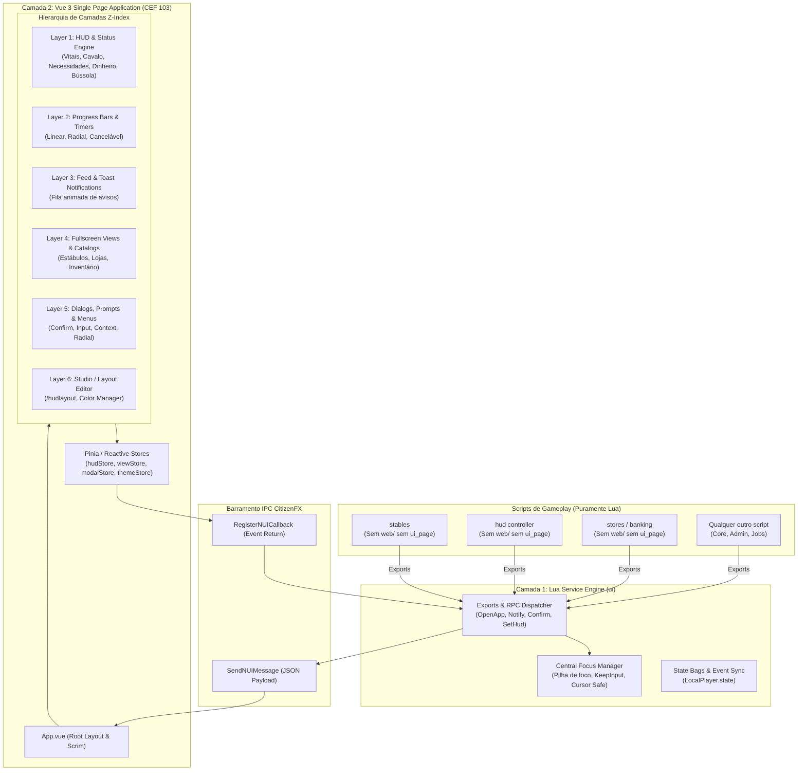

# Arquitetura e Engenharia do Novo `ui` (SDD Spec 00)
> **Padrão:** Spec-Driven Development (SDD) & Clean Architecture  
> **Status:** Aprovado para Planejamento  
> **Target:** RedM (CitizenFX RDR3 - Game Build 1491+)  
> **CEF Target:** Chromium Embedded Framework v103 (Legacy Compatibility)  
> **Stack Base:** Lua 5.4 + Vue 3 (Composition API / `<script setup>`) + Vite 6 + Tailwind CSS v3 (PostCSS + Autoprefixer)

---

## 1. Visão Geral e Filosofia do Sistema

O **`ui`** é concebido como o **Single Chromium NUI Engine & Interface Service** definitivo do ecossistema `[westrp]`. Ele substitui integralmente a tentativa anterior de Vanilla JS e resolve em definitivo a fragmentação observada no `rsm_nuikit`, `rsm_hud` e `rsm_stables`.

### 1.1 O Princípio Fundamental: "Single CEF NUI Engine"
Em RedM, cada resource que declara `ui_page` no `fxmanifest.lua` aloca:
1. Uma superfície de renderização independente na GPU (DirectX/Vulkan overlay buffer).
2. Um processo compositor do Chromium e um pipeline de V8 JavaScript Heap isolado.
3. Um canal assíncrono IPC isolado com o cliente do jogo.

Ter 3 ou mais resources com `ui_page` (`rsm_nuikit`, `rsm_hud`, `rsm_stables`, etc.) causa:
- **Degradação de FPS e micro-stutters** pelo overhead de composição gráfica concorrente.
- **Vazamento e consumo excessivo de RAM/VRAM**.
- **Guerra de Foco de Cursor (`SetNuiFocus`)**, gerando travamento permanente do mouse do jogador.

**A Solução `ui`:**
- **Apenas o `ui` possui `ui_page` e pasta `web/`**.
- Todos os outros resources do servidor (`hud`, `stables`, `inventory`, `stores`, etc.) são **100% puramente Lua**, consumindo o `ui` através de Exports padronizados e RPC Callbacks.

---

## 2. Diagrama Arquitetural de Camadas



---

## 3. Diretrizes de Engenharia e Compatibilidade com Chromium CEF 103

O CEF embarcado no RedM/FiveM é baseado no **Chromium 103**. Por isso, todo o código web do `ui` deve aderir às seguintes restrições:

1. **Tailwind CSS v3 (e NÃO v4):**
   - Usar `tailwindcss@^3.4.17` com `postcss` e `autoprefixer`.
   - Garantir suporte a browsers legados (targets: `chrome >= 103`).
   - Evitar espaços de cor `oklch()` nativos sem fallback para `rgb`/`rgba`/`hex`.
   - Evitar pseudo-classes inexistentes no Chromium 103 (ex: `:has()`).
2. **Caminhos de Assets Relativos e Base Bridge:**
   - O `vite.config.js` deve utilizar `base: "./"` em modo build para evitar URLs absolutas raiz que geram erro 404 no protocolo `https://cfx-nui-ui/`.
   - Fontes e texturas 9-slice devem ser mapeadas via CSS Custom Properties no `:root`.
3. **Isolamento de Transparência e Scrim:**
   - `html` e `body` são sempre `background: transparent !important`.
   - Apenas quando uma tela opaca/modal estiver ativa, uma camada de *scrim* escurece levemente o cenário do jogo sem cobrir a visão com telas pretas sólidas.

---

## 4. O Sistema Central de Foco (`FocusManager`)

Para erradicar definitivamente os conflitos de foco e cursor travado:

```lua
-- Regra de Ouro: Nenhum resource além do ui chama SetNuiFocus.
local focusStack = {}

function PushFocus(sourceId, hasCursor, keepInput)
    focusStack[#focusStack + 1] = {
        id = sourceId,
        cursor = hasCursor,
        keepInput = keepInput or false
    }
    ApplyFocus()
end

function PopFocus(sourceId)
    for i = #focusStack, 1, -1 do
        if focusStack[i].id == sourceId then
            table.remove(focusStack, i)
            break
        end
    end
    ApplyFocus()
end

function ApplyFocus()
    if #focusStack == 0 then
        SetNuiFocus(false, false)
        SetNuiFocusKeepInput(false)
        return
    end
    
    local top = focusStack[#focusStack]
    SetNuiFocus(true, top.cursor)
    SetNuiFocusKeepInput(top.keepInput)
end
```

---

## 5. Padrão de Comunicação por Esquema (Dynamic View Engine)

Em vez de criar uma NUI para cada sistema de gameplay, o `ui` disponibiliza um **Host de Views Dinâmicas**:
- O `stables` simplesmente envia um schema de catálogo para o `ui`:
  ```lua
  exports.ui:OpenApp("stables", {
      title = "Estábulos de Valentine",
      rides = myRides,
      shop = availableBreeds,
      tack = tackCatalog
  }, function(action, payload)
      -- Callbacks de ação do jogador (ex: comprar, equipar, transferir)
  end)
  ```
- O frontend Vue do `ui` monta a view registrada correspondente (`src/views/stables/StableView.vue`), aproveitando todos os 36 componentes compartilhados e o tema global, mantendo 1 única instância CEF ativa no jogo.
