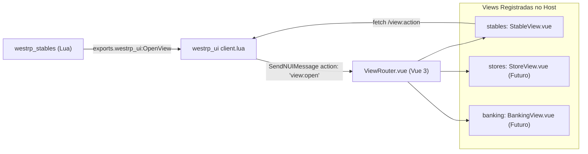

# Engine de Views e Módulo de Estábulos (SDD Spec 04)
> **Padrão:** Dynamic View Host Architecture  
> **Localização:** `src/views/`  
> **Primeiro Consumidor:** `westrp_stables`

---

## 1. O Problema Resolvido: O Fim dos CEFs Isolados para Scripts de Gameplay

Anteriormente, o `rsm_stables` duplicou toda a stack web do `rsm_nuikit` para conseguir renderizar sua tela de estábulos, gerando 2 CEFs abertos e duplicação maciça de código.

No novo modelo do `westrp_ui`:
1. O `westrp_stables` torna-se um **resource puramente Lua** (pasta `web/` e `ui_page` removidas do `fxmanifest.lua`).
2. A tela de estábulos passa a ser uma **View Registrada** dentro do `westrp_ui`: `src/views/stables/StableView.vue`.
3. O `westrp_stables` abre a interface chamando um único export:
   ```lua
   exports.westrp_ui:OpenView("stables", initialData)
   ```
4. A tela de estábulos usa exatamente os mesmos componentes base (`Card`, `Button`, `ItemSlot`, `ArrowSelector`, `StatBar`, `Tabs`, etc.) do kit, mantendo coerência visual absoluta e zero duplicidade.

---

## 2. A Arquitetura do View Router Interno

No `westrp_ui/web/src/views/ViewRouter.vue`:



---

## 3. Especificação Completa do `StableView.vue`

O `StableView.vue` é dividido em 4 módulos principais acessíveis por abas (`Tabs.vue`):

### 3.1 Aba 1: Loja de Cavalos & Carroças (`ShopTab.vue`)
- **Seletor de Categoria:** Cavalos de Montaria, Cavalos de Tiro, Carroças de Carga, Carruagens.
- **Lista de Raças e Pelagens:**
  - Exibição de cards com nome da raça, pelagem, temperamento e preço ($ ou Gold).
  - Barras de atributos (`StatBar.vue`): Velocidade, Aceleração, Vigor, Saúde e Manuseio (Handling).
- **Integração 3D de Câmera:**
  - Ao selecionar um cavalo/carroça, o Vue envia a ação `stables:preview` para o Lua.
  - O script Lua do estábulo move a câmera e spawna a entidade de demonstração no balcão em tempo real.
- **Ação de Compra:**
  - Botão "Comprar" abre o `ConfirmDialog` do próprio kit com resumo de custos.
  - O jogador pode digitar o nome do animal antes de confirmar a compra (`TextInput.vue`).

### 3.2 Aba 2: Meus Animais (`MyRidesTab.vue`)
- **Lista de Animais Registrados:**
  - Cards com status: Ativo/Chamado, Guardado, Ferido/Morto (com contador regressivo `Timer`).
  - Nível de vínculo (*Bonding* de 1 a 4) com barra de progresso.
  - Sexo, raça e nome customizado.
- **Ações Rápidas:**
  - **Chamar / Retirar do Estábulo:** Spawna a montaria no ponto de saída.
  - **Guardar:** Remove a montaria do mundo.
  - **Tratar / Reviver:** Paga taxa veterinária caso o animal tenha sido ferido.
  - **Equipar Arreios:** Transfere a navegação diretamente para a aba de Arreios.

### 3.3 Aba 3: Customização de Arreios (`TackTab.vue`)
- **Categorias RDR2:**
  - Selas (*Saddles*), Mantas (*Blankets*), Estribos (*Stirrups*), Alforjes (*Saddlebags*), Cantis (*Bedrolls*), Chifre da Sela (*Horns*), Crina (*Manes*), Cauda (*Tails*), Máscaras (*Masks*).
- **Seletor de Variações:**
  - `ArrowSelector.vue` com troca imediata de textura no animal de prévia 3D.
  - Preço por peça e opção de salvar conjunto.

### 3.4 Aba 4: Transferência de Propriedade (`TransferTab.vue`)
- Permite vender ou doar um cavalo/carroça para um jogador próximo:
  - Input para selecionar o jogador (ID ou lista de cidadãos no raio de 5 metros).
  - Campo de valor ($) ou doação gratuita.
  - O jogador comprador recebe uma notificação via `ConfirmDialog` com os dados completos do animal.

---

## 4. Protocolo de Comunicação NUI do Módulo de Estábulos

| Ação NUI | Direção | Payload | Descrição |
| :--- | :--- | :--- | :--- |
| `stables:preview` | Vue -> Lua | `{ kind: 'horse', model: 'A_C_Horse_Morgan_Bay', tack: { ... } }` | Atualiza a entidade no palco 3D do estábulo |
| `stables:buy` | Vue -> Lua | `{ type: 'horse', breedId: 'morgan', coatId: 'bay', name: 'Trovão' }` | Solicita compra ao servidor |
| `stables:spawn` | Vue -> Lua | `{ rideId: 12 }` | Retira o animal próprio do estábulo |
| `stables:store` | Vue -> Lua | `{ rideId: 12 }` | Guarda o animal próprio |
| `stables:saveTack` | Vue -> Lua | `{ rideId: 12, tack: { ... } }` | Salva a configuração de arreios comprada |
| `stables:transfer` | Vue -> Lua | `{ rideId: 12, targetPlayer: 4, price: 50.0 }` | Inicia proposta de venda para outro jogador |
| `stables:close` | Vue -> Lua | `{}` | Fecha a tela e devolve a câmera ao jogador |
