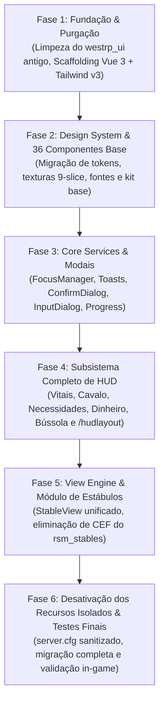

# Roadmap de Execução & Tarefas Detalhadas (SDD Spec 06)
> **Padrão:** Spec-Driven Development (SDD)  
> **Status:** Pronto para Execução  
> **Estimativa:** 6 Fases Estruturadas com Critérios Estritos de Aceite (DoD)

---

## 1. Visão Geral das Fases



---

## 2. Detalhamento de Fases, Tarefas e Subtarefas

### 📌 FASE 1: Fundação, Purgação e Scaffolding Web
**Objetivo:** Remover os resíduos antigos do `westrp_ui` (Vanilla JS/CSS) e montar o ambiente moderno Vue 3 + Vite + Tailwind v3 compatível com CEF 103.

- [ ] **Tarefa 1.1: Purgação dos Arquivos Obsoletos**
  - Subtarefa 1.1.1: Deletar pasta legada `westrp_ui/html/`.
  - Subtarefa 1.1.2: Limpar scripts legados em `westrp_ui/client/` (`hud.lua`, `main.lua`, `native_hud.lua`, `showcase.lua`).
  - Subtarefa 1.1.3: Atualizar `fxmanifest.lua` para apontar `ui_page 'web/dist/index.html'`.
- [ ] **Tarefa 1.2: Inicialização do Scaffolding Vite + Vue 3**
  - Subtarefa 1.2.1: Criar `westrp_ui/web/package.json` com `vue@^3.5.13`, `vite@^6.0.0`, `tailwindcss@^3.4.17`, `postcss`, `autoprefixer`.
  - Subtarefa 1.2.2: Criar `vite.config.js` configurado com `base: "./"` para garantir links relativos válidos no CEF.
  - Subtarefa 1.2.3: Criar `tailwind.config.js` com tokens RDR2 e `postcss.config.js`.
  - Subtarefa 1.2.4: Copiar fontes oficiais (`fonts/`) e texturas RDR2 (`tex/`) de `rsm_nuikit/web/public/` para `westrp_ui/web/public/`.
- **Critério de Aceite (DoD):** `npm run build` executa em `westrp_ui/web/` sem erros gerando `web/dist/index.html`.

---

### 📌 FASE 2: Design System & Biblioteca de Componentes Base
**Objetivo:** Migrar e padronizar os 36 componentes de interface em `src/components/kit/`.

- [ ] **Tarefa 2.1: Sistema de Variáveis e Estilos Globais**
  - Subtarefa 2.1.1: Criar `src/styles.css` com classes de máscara 9-slice RDR2 (`.tx-card`, `.tx-shell`, `.tx-dialog`).
  - Subtarefa 2.1.2: Criar `src/lib/theme.js` para o Color Manager (tokens `--kit-accent`, `--kit-surface-rgb`, etc.).
- [ ] **Tarefa 2.2: Migração dos 36 Componentes Base**
  - Subtarefa 2.2.1: Ações (`Button.vue`, `IconButton.vue`, `ArrowButton.vue`).
  - Subtarefa 2.2.2: Formulários (`TextInput.vue`, `Checkbox.vue`, `RadioGroup.vue`, `Switch.vue`, `Slider.vue`, `Stepper.vue`, `ArrowSelector.vue`).
  - Subtarefa 2.2.3: Containers (`Card.vue`, `Brackets.vue`, `Divider.vue`, `VDivider.vue`, `Tabs.vue`, `Tag.vue`, `Counter.vue`, `Swatch.vue`).
  - Subtarefa 2.2.4: Prompts de Teclado (`KeyCap.vue`, `Prompt.vue`, `PressPrompt.vue`, `HoldPrompt.vue`).
  - Subtarefa 2.2.5: Medidores (`CoreMeter.vue`, `CoreIcon.vue`, `ProgressBar.vue`, `StatBar.vue`).
  - Subtarefa 2.2.6: Slots e Inventário (`ItemSlot.vue`, `InventoryCard.vue`, `DragGhost.vue`).
- **Critério de Aceite (DoD):** Todos os componentes compilam sem warnings de linter e funcionam perfeitamente na visualização de catálogo.

---

### 📌 FASE 3: Core Services, Focus Manager e Modais
**Objetivo:** Construir o barramento Lua de comunicação e os serviços essenciais de interação.

- [ ] **Tarefa 3.1: Central Focus Manager (Lua)**
  - Subtarefa 3.1.1: Implementar pilha de foco segura em `client/focus.lua` com suporte a `SetNuiFocusKeepInput`.
  - Subtarefa 3.1.2: Adicionar listener de segurança no `onResourceStop` para liberar o cursor caso o script reinicie.
- [ ] **Tarefa 3.2: Camada de Notificações (Toast Service)**
  - Subtarefa 3.2.1: Criar `src/components/hud/ToastStack.vue` e `ToastItem.vue`.
  - Subtarefa 3.2.2: Criar exports `exports.westrp_ui:Notify` (Client e Server).
- [ ] **Tarefa 3.3: Diálogos Modais (Confirm & InputDialog)**
  - Subtarefa 3.3.1: Criar `src/components/modals/ConfirmDialog.vue` com navegação por teclado (Enter/ESC).
  - Subtarefa 3.3.2: Criar `src/components/modals/InputDialog.vue` dinâmico para múltiplos campos.
  - Subtarefa 3.3.3: Expor `exports.westrp_ui:Confirm` e `exports.westrp_ui:InputDialog`.
- [ ] **Tarefa 3.4: Action Progress Bar**
  - Subtarefa 3.4.1: Criar `src/components/hud/ActionProgressBar.vue` com suporte a animação e cancelamento.
  - Subtarefa 3.4.2: Expor `exports.westrp_ui:ProgressBar`.
- **Critério de Aceite (DoD):** Testar acionamento de toasts, confirms e inputs simultâneos sem perda de cursor nem sobreposição incorreta de z-index.

---

### 📌 FASE 4: Subsistema Completo de HUD & Layout Manager
**Objetivo:** Integrar os widgets do jogador e a ferramenta `/hudlayout` com reatividade total.

- [ ] **Tarefa 4.1: Widgets de Vitais & Status**
  - Subtarefa 4.1.1: Integrar `PlayerCores.vue` e `HorseCores.vue`.
  - Subtarefa 4.1.2: Integrar `NeedsBar.vue` (Fome, Sede, Temperatura).
  - Subtarefa 4.1.3: Integrar `MoneyPanel.vue` e `ClockWeather.vue`.
  - Subtarefa 4.1.4: Integrar `LocationBanner.vue`, `VoiceIndicator.vue`, `WeaponAmmo.vue`, `WantedStatus.vue`.
- [ ] **Tarefa 4.2: Reatividade via State Bags e Lua Controller**
  - Subtarefa 4.2.1: Implementar `client/hud_controller.lua` com escuta em `LocalPlayer.state['westrp:char']` (0.00ms idle).
  - Subtarefa 4.2.2: Monitorar vitais de ped e montaria com ticks inteligentes.
- [ ] **Tarefa 4.3: O Gerenciador de Layout (`/hudlayout`)**
  - Subtarefa 4.3.1: Criar `src/components/hud/layout/LayoutManager.vue` com arraste normalizado (0.00 a 1.00 X/Y).
  - Subtarefa 4.3.2: Implementar salvamento e carregamento via banco de dados (`oxmysql`).
- **Critério de Aceite (DoD):** O HUD renderiza perfeitamente no jogo; o comando `/hudlayout` permite reposicionar e salvar o layout de forma persistente.

---

### 📌 FASE 5: View Engine & Unificação do `westrp_stables`
**Objetivo:** Implementar o host de views complexas e migrar a interface dos estábulos para o `westrp_ui`.

- [ ] **Tarefa 5.1: View Router no Vue**
  - Subtarefa 5.1.1: Criar `src/views/ViewRouter.vue` com animação suave de transição de tela cheia.
  - Subtarefa 5.1.2: Criar exports `exports.westrp_ui:OpenView` e `CloseView`.
- [ ] **Tarefa 5.2: Migração da View de Estábulos**
  - Subtarefa 5.2.1: Criar `src/views/stables/StableView.vue` contendo:
    - `ShopTab.vue` (compra de cavalos e carroças com preview 3D).
    - `MyRidesTab.vue` (gerenciamento e chamada).
    - `TackTab.vue` (personalização de arreios).
    - `TransferTab.vue` (transferência para jogadores).
- [ ] **Tarefa 5.3: Refatoração do `westrp_stables` (Lua Only)**
  - Subtarefa 5.3.1: Deletar pasta `web/` do `rsm_stables`.
  - Subtarefa 5.3.2: Remover `ui_page` e `files` do `fxmanifest.lua` do `rsm_stables`.
  - Subtarefa 5.3.3: Adaptar o `client.lua` do estábulo para chamar `exports.westrp_ui:OpenView("stables", data)`.
- **Critério de Aceite (DoD):** O estábulo abre, permite comprar cavalos, testar arreios e mudar de aba consumindo a interface através do `westrp_ui`.

---

### 📌 FASE 6: Desativação do Legado e Sanitização
**Objetivo:** Excluir os resources obsoletos e verificar a integridade do servidor.

- [ ] **Tarefa 6.1: Limpeza do Workspace**
  - Subtarefa 6.1.1: Deletar ou arquivar `rsm_nuikit` e `rsm_hud`.
  - Subtarefa 6.1.2: Renomear `rsm_stables` para `westrp_stables` seguindo o padrão arquitetural do projeto.
- [ ] **Tarefa 6.2: Sanitização do `server.cfg`**
  - Subtarefa 6.2.1: Substituir referências antigas por:
    ```cfg
    ensure westrp_ui
    ensure westrp_stables
    ```
- [ ] **Tarefa 6.3: Validação de Performance (Resmon & CEF)**
  - Subtarefa 6.3.1: Verificar no console F8 (`resmon 1` e `nui_devTools`) se existe estritamente **1 única página CEF ativa** e resmon em 0.00ms.
