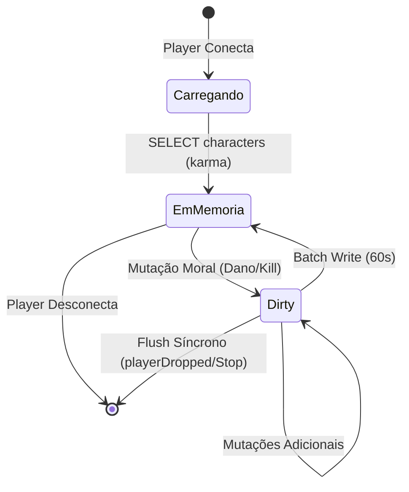

# Arquitetura de Software — `westrp_karma`

Este documento detalha o desenho arquitetural do módulo **`westrp_karma`**, estruturado com base no padrão **Ports & Adapters (Arquitetura Hexagonal)** e orientado a **Domain-Driven Design (DDD)**.

---

## 1. Visão Arquitetural Hexagonal

O princípio fundamental do `westrp_karma` é o **desacoplamento estrito** da regra de negócio em relação a frameworks externos (VORP Core), drivers de banco de dados (`oxmysql`) e APIs nativas do RedM.

```text
                             [ CLIENTE REDM ]
                                     │
                                     │ (Network Events)
                                     ▼
               ┌──────────────────────────────────────────┐
               │         Primary Adapters (Entrada)       │
               │  - CombatDetector (Client)               │
               │  - NetEvent Controller (Server)          │
               │  - Public Exports API                    │
               └─────────────────────┬────────────────────┘
                                     │
                                     ▼
               ┌──────────────────────────────────────────┐
               │            Application Core              │
               │             (KarmaService)               │
               │  - Orquestração de Casos de Uso         │
               │  - Pipeline de Segurança (Verifier)      │
               └──────────────┬───────────────────────────┘
                              │
               ┌──────────────┴───────────────────────────┐
               │                Pure Domain               │
               │  - KarmaEntity (Aggregate Root)          │
               │  - TierEvaluator (Pure Domain Rules)     │
               │  - SelfDefensePool (Temporal Buffer)     │
               └──────────────┬───────────────────────────┘
                              │
                              ▼
               ┌──────────────────────────────────────────┐
               │        Secondary Adapters (Saída)        │
               │  - DatabaseAdapter (oxmysql / Batch UoW) │
               │  - FrameworkAdapter (VORP Core Bridge)   │
               │  - HonorPresenter (Client Native HUD)    │
               └──────────────────────────────────────────┘
```

---

## 2. Camadas do Sistema

### 2.1 Domain Layer (`server/domain/` e `shared/`)
* **Isolamento Total:** Não realiza chamadas para funções de FiveM (`GetPlayerPed`, `TriggerEvent`), nem para `MySQL`.
* **Componentes:**
  * **`KarmaEntity`**: Entidade que encapsula o identificador do personagem, pontuação numérica, tier atual, estado de persistência (`isDirty`) e métodos de mutação (`ApplyDelta`, `SetTier`).
  * **`TierEvaluator`**: Módulo determinístico que mapeia pontuações numéricas em objetos de patamar moral e calcula índices visuais.
  * **`SelfDefensePool`**: Gerenciador de memória com buffer temporal e *Lazy Garbage Collection* para manter registros de agressão ativa e verificar direitos de resposta armada.

### 2.2 Application Services (`server/services/`)
* **`KarmaService`**:
  * Ponto focal de orquestração.
  * Carrega dados do jogador no login através do `DatabaseAdapter`.
  * Processa eventos de dano e abates validados pelo `CombatVerifier`.
  * Dispara notificações e atualizações de UI via `HonorPresenter`.

### 2.3 Security Pipeline (`server/security/`)
* **`CombatVerifier`**:
  * Valida integridade física dos combatentes.
  * Compara distâncias euclidianas no servidor.
  * Garante que mortes reportadas correspondam a entidades que efetivamente entraram em estado de óbito.
  * Detecta tentativas de teletransporte e injeção de pacotes.

### 2.4 Infrastructure & Adapters (`server/infrastructure/`)
* **`DatabaseAdapter`**:
  * Implementa o padrão **Unit of Work**.
  * Mantém cache em memória (`KarmaEntity`).
  * Realiza consolidação em lote (batching) periódico através de `MySQL.transaction.await`.
  * Garante flush imediato síncrono no evento de desconexão (`playerDropped`) ou encerramento do recurso (`onResourceStop`).
* **`FrameworkAdapter`**:
  * Único ponto de contato com o VORP Core (`VORPcore.getUser(src)`).
  * Traduz identificadores de sessão (`source`) em identificadores persistentes de personagem (`charidentifier`).

---

## 3. Ciclo de Vida dos Dados (Data Flow)



1. **Leitura Inicial (Cold Start):** Quando o personagem surge na sessão, o `FrameworkAdapter` obtém o `charidentifier` e o `DatabaseAdapter` consulta o valor armazenado no banco. Uma instância de `KarmaEntity` é alocada na memória.
2. **Mutação em Memória:** Ao ocorrer uma ação moral (ex: morte de um civil), a `KarmaEntity` tem seu saldo ajustado e recebe a flag `isDirty = true`.
3. **Consolidação Periódica (Warm Batching):** A cada 60 segundos, a thread do `DatabaseAdapter` busca todas as entidades marcadas como `dirty`, gera um lote unificado e envia ao MySQL em uma transação única. As flags `dirty` são zeradas.
4. **Desconexão Segura (Fail-Safe Flush):** Se o jogador desconectar ou o resource for reiniciado, as entidades `dirty` pendentes são gravadas síncronamente antes de serem liberadas da memória.
