# Software Design Document (SDD): Resource `westrp_karma`

Este documento define a especificação técnica e comportamental formal para o desenvolvimento do resource **`westrp_karma`**, desenvolvido para o framework **VORP Core** e ecossistema **WestRP** no ambiente **RedM (FXServer)**.

---

## 1. Visão Geral e Objetivos do Sistema

O objetivo do `westrp_karma` é fornecer uma infraestrutura de **Moralidade Dinâmica e Karma Sistêmico** inspirada em mecânicas clássicas de MMORPGs, adaptada para balanceamento de PvP/PvE em servidores de RP Semi-Hardcore.

### Objetivos Principais

* **Desacoplamento de Domínio (SoC / Hexagonal):** A lógica central de cálculo moral é pura e testável, sem dependência direta de APIs FiveM/RedM ou chamadas síncronas de banco de dados.
* **Resiliência a Exploits de Combate:** Validação de envelopes de rede físicos (distância, linha de visada, integridade de entidades) antes de deferir flags de legítima defesa ou penalidades por assassinato.
* **Escalabilidade de I/O:** Eliminação de consultas síncronas e queries concorrentes via padrão *Unit of Work / Dirty Batch Write* com `oxmysql`.
* **Apresentação Nativa Imersiva:** Integração direta com a barra de honra original do RDR2 via `DataBinding` (`RPGStatusIcons -> HonorIcon`), proporcionando resposta visual nativa e efeitos sonoros originais a 0.00ms.
* **Suporte Completo a PvP e PvE:** Diferenciação determinística entre assassinatos de jogadores desarmados, confrontos armados, ataques a cidadãos NPCs inocentes e confronto com delegados da lei.

---

## 2. Diagrama de Sequência do Ciclo de Combate

```mermaid
sequenceDiagram
    autonumber
    participant A as Client (Atacante)
    participant V as Client (Vítima)
    participant S_Sec as Server (CombatVerifier)
    participant S_Pool as Server (SelfDefensePool)
    participant S_Karma as Server (KarmaService)
    participant S_Pres as Client (HonorPresenter)
    participant DB as oxmysql (DatabaseAdapter)

    Note over A,V: Combate em Andamento
    A->>V: Causa Dano / Disparo
    V->>S_Sec: ReportDamageEvent(attackerSrc, weaponHash, coords)
    
    rect rgb(30, 30, 45)
        Note over S_Sec: Pipeline de Segurança
        S_Sec->>S_Sec: Valida distância física (<= 300m)
        S_Sec->>S_Sec: Valida tolerância de coordenadas (<= 15m)
        S_Sec->>S_Pool: IsHostile(victimSrc, attackerSrc)?
    end

    alt Vítima é Agressora Prévia (Legítima Defesa Válida)
        S_Pool-->>S_Sec: true (Legítima Defesa)
        S_Sec-->>A: Notifica: "Legítima Defesa (Karma Preservado)"
    else Agressão Sem Provocação (PK / Crime)
        S_Pool-->>S_Sec: false (Ataque Ilegítimo)
        S_Pool->>S_Pool: RegisterAggression(attackerSrc, victimSrc, duration)
        S_Sec->>S_Karma: ApplyPenalty(attackerSrc, amount, reason)
        
        rect rgb(20, 35, 20)
            Note over S_Karma: Domínio & Cache em Memória
            S_Karma->>S_Karma: KarmaEntity.ApplyDelta(-120)
            S_Karma->>S_Karma: TierEvaluator.Resolve(novoKarma)
            S_Karma->>S_Karma: Marca Entidade como "DIRTY"
        end

        S_Karma->>S_Pres: TriggerClientEvent("westrp_karma:client:onKarmaUpdated", payload)
        Note over S_Pres: Renderiza Barra Nativa (HonorIcon 1-16) + Áudio Original
    end

    opt A cada 60s ou no playerDropped / shutdown
        Note over S_Karma,DB: Unit of Work / Batch Write
        S_Karma->>DB: UPDATE characters SET karma = ?, karma_tier = ? (Batch)
        DB-->>S_Karma: Commit OK (Limpa flags dirty)
    end
```



---

## 3. Modelo de Domínio e Tipos de Dados

### 3.1 Definições de Tipos (`shared/types.lua`)

```lua
---@class KarmaTier
---@field id string Identificador unívoco do tier
---@field name string Rótulo de exibição amigável
---@field min integer Limite inferior inclusivo
---@field max integer Limite superior inclusivo
---@field nativeState integer Índice visual para o HonorIcon nativo (1 a 16)
---@field shopDiscount number Multiplicador de preço nas lojas (-0.20 = 20% desc., +0.25 = 25% acréscimo)
---@field bountyEligible boolean Flag indicando elegibilidade para cartazes de procurado
---@field baseBounty number Valor base da recompensa em dólares (se aplicável)
---@field color string Cor representativa em Hexadecimal

---@class CombatReportPayload
---@field isPlayer boolean Flag de distinção PvP vs PvE
---@field victimServerId integer? Source ID da vítima (se for jogador)
---@field victimModel integer? Hash do modelo (se for NPC)
---@field isFatal boolean Flag que indica término de vida
---@field weaponHash integer Hash numérico da arma empregada
---@field attackerCoords vector3 Vetor tridimensional do atacante no instante do evento
---@field victimCoords vector3 Vetor tridimensional da vítima no instante do evento
---@field distance number Distância euclidiana calculada localmente
```

---

## 4. Arquitetura de Software e Padrões Aplicados

```text
┌─────────────────────────────────────────────────────────────────────────┐
│                     Client Layer (Apresentação & HUD)                  │
│        - CombatDetector (CEventNetworkEntityDamage Listener)            │
│        - HonorPresenter (RDR2 Native DataBinding RPGStatusIcons)        │
└────────────────────────────────────┬────────────────────────────────────┘
                                     │ Network Events
                                     ▼
┌─────────────────────────────────────────────────────────────────────────┐
│                       Server Security Pipeline                          │
│                            (CombatVerifier)                             │
└────────────────────────────────────┬────────────────────────────────────┘
                                     │ Validated Events
                                     ▼
┌─────────────────────────────────────────────────────────────────────────┐
│                          Application Service                            │
│                             (KarmaService)                              │
├────────────────────────────────────┬────────────────────────────────────┤
│           Domain Layer             │        Infrastructure Layer        │
│  - KarmaEntity (Aggregate Root)    │  - DatabaseAdapter (Unit of Work)  │
│  - TierEvaluator (Pure Domain)     │  - FrameworkAdapter (VORP Bridge)  │
│  - SelfDefensePool (Window Buffer) │                                    │
└────────────────────────────────────┴────────────────────────────────────┘
```

### 4.1 Princípios Aplicados

* **Single Responsibility (SRP):** Cada módulo possui exatamente um propósito bem delimitado.
* **Separation of Concerns (SoC):** A interface com o VORP Core existe exclusivamente dentro de `FrameworkAdapter`.
* **Open/Closed Principle (OCP):** A escala de Tiers é declarativa; novas faixas morais não exigem alteração na lógica de cálculo.
* **Batching Pattern (Unit of Work):** Alterações de estado são consolidadas em cache de memória e sincronizadas com o banco a cada ciclo temporal fixo ou em eventos de ciclo de vida do servidor.

---

## 5. Especificação Funcional dos Componentes

### 5.1 `TierEvaluator` (Shared / Pure Domain)
* **Contrato:**
  * `Resolve(karma: integer) -> KarmaTier`
  * `Clamp(karma: integer) -> integer`
  * `CalculateNativeState(karma: integer) -> integer`
* **Invariantes:**
  * Valores sempre contidos no intervalo de configuração $[-1000, 1000]$.
  * A busca por faixas é determinística; em colisões de borda, o menor índice prevalece.

### 5.2 `SelfDefensePool` (Server / Domain)
* **Contrato:**
  * `RegisterAggression(attackerSrc: integer, victimSrc: integer) -> void`
  * `IsHostile(attackerSrc: integer, targetSrc: integer) -> boolean`
  * `ClearTarget(targetSrc: integer) -> void`
* **Regras de Negócio:**
  * Se o Jogador A ataca o Jogador B, cria-se um registro com expiração em $T + \text{Config.SelfDefenseDuration}$.
  * Se o Jogador B já estava registrado como agressor contra o Jogador A, a nova agressão é considerada contra-ataque e não altera a culpa original.
  * Validações limpam automaticamente registros expirados na memória (Lazy GC).

### 5.3 `CombatVerifier` (Server / Security)
* **Contrato:**
  * `VerifyReport(attackerSrc: integer, payload: CombatReportPayload) -> (boolean, string)`
* **Regras de Verificação:**
  * **Verificação de Existência:** `GetPlayerPed` deve ser válido para ambos os IDs quando for PvP.
  * **Anti-Teleport / Anti-Desync:** $\vert{}\text{realCoords} - \text{payloadCoords}\vert{} \le 15.0$ unidades.
  * **Cota Espacial de Disparo:** Distância real não pode exceder $300.0$ unidades de mundo.
  * **Integridade de Morte:** Caso `payload.isFatal == true`, o servidor confere se a entidade atingida está de fato morta ou incapacitada (`IsEntityDead` ou vida $\le 0$).

### 5.4 `HonorPresenter` (Client / UI)
* Conecta a pontuação moral diretamente ao container nativo `RPGStatusIcons -> HonorIcon` via `DataBinding`.
* Mantém a barra visível pelo tempo parametrizado (`Config.UI.HonorDisplayDuration`).
* Dispara o áudio original correspondente: som clássico de honra positiva vs som sombrio de honra negativa.

---

## 6. Persistência e Esquema de Dados

### 6.1 DDL (`schema.sql`)

```sql
ALTER TABLE `characters` 
ADD COLUMN IF NOT EXISTS `karma` INT NOT NULL DEFAULT 0,
ADD COLUMN IF NOT EXISTS `karma_tier` VARCHAR(32) NOT NULL DEFAULT 'neutral',
ADD COLUMN IF NOT EXISTS `bounty_price` DECIMAL(10,2) NOT NULL DEFAULT 0.00;

CREATE INDEX idx_character_karma ON `characters` (`charidentifier`, `karma`);
```

### 6.2 Política de Escrita (`DatabaseAdapter`)
* O servidor mantém uma lista de entidades modificadas (`dirty`).
* A thread de sincronização executa um loop a cada $N$ segundos (padrão: 60s), gerando uma única transação em lote.
* Na desconexão (`playerDropped`) ou desligamento do servidor (`onResourceStop` e `txAdmin:events:serverStopping`), todas as entidades pendentes são persistidas de forma síncrona com `MySQL.transaction.await` antes da desalocação do cache.

---

## 7. Contrato de API Pública (Exports)

```lua
-- Altera a moralidade de um jogador ativo
exports['westrp_karma']:ModifyKarma(source, amount, reason)

-- Retorna o valor numérico bruto (-1000 a 1000)
exports['westrp_karma']:GetPlayerKarma(source)

-- Retorna a tabela completa do Tier atual
exports['westrp_karma']:GetPlayerTier(source)

-- Retorna a porcentagem de modificação em lojas (ex: -0.15 para desconto de 15%)
exports['westrp_karma']:GetShopModifier(source)

-- Verifica se um jogador é elegível para caçadores de recompensa
exports['westrp_karma']:IsBountyEligible(source)
```

---

## 8. Casos de Teste e Validação (Test Scenarios)

| ID | Caso de Teste | Condição de Entrada | Resultado Esperado |
| :--- | :--- | :--- | :--- |
| **TC-01** | PK sem provocação | Player A ataca e mata Player B (sem histórico no `SelfDefensePool`). | Karma de A reduzido em -120; B mantém karma; log no console. |
| **TC-02** | Legítima defesa válida | Player A causa dano em Player B. Player B reage e mata Player A em até 180s. | Karma de B permanece inalterado; notificação de legítima defesa para B. |
| **TC-03** | Pacote forjado (Fake Kill) | Injeção de evento com `isFatal = true`, mas vítima com vida > 0 no servidor. | Relatório rejeitado com erro `FAKE_FATAL_ASSERTION`; sem alteração moral. |
| **TC-04** | Spoofing de coordenadas | Atacante envia coordenadas defasadas em > 15m da coordenada real no server. | Relatório rejeitado com erro `COORDINATE_SPOOF_DETECTED`. |
| **TC-05** | Transição de Tier e Bounty | Player atinge Karma $\le -600$. | Evento `westrp_karma:server:onBountyEligible` disparado; tier atualizado para `outlaw`. |
| **TC-06** | Apresentação Visual Nativa | Player ganha ou perde karma. | Barra de Honra nativa do RDR2 desliza no rodapé com o estado (1-16) e toca o áudio temático. |
| **TC-07** | Crash/Restart Seguro | Servidor é reiniciado enquanto há entidades `dirty` em cache. | Handler `onResourceStop` grava todas as entidades síncronas sem perda de dados. |
