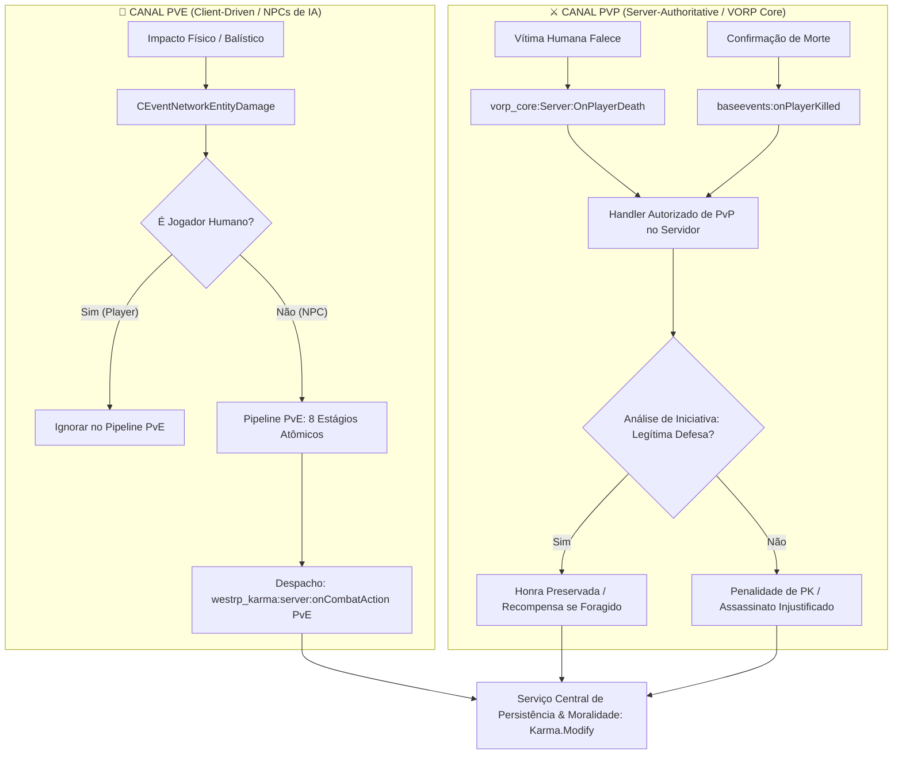

# Especificação Técnica & Tasks: Arquitetura Dual-Channel (PvE vs PvP)
> **Resource:** `westrp_karma`  
> **Padrão:** Spec-Driven Development (SDD) & Server-Authoritative Architecture  
> **Status:** Aprovado para Execução  
> **Versão da Spec:** 1.2.0  
> **Referência do Framework:** `vorp_core/client/respawnsystem.lua` & `baseevents/deathevents.lua`

---

## 1. Contexto & Justificativa Técnica

Durante a evolução do sistema de combate balístico ([SPEC_FIREARMS_COMBAT.md](file:///c:/txData/VORPCore_B1A065.base/resources/%5Bwestrp%5D/%5Bsystems%5D/westrp_karma/docs/SPEC_FIREARMS_COMBAT.md)), identificou-se um acoplamento indesejado: as verificações de alvos jogadores reais (**PvP**) estavam sendo processadas no mesmo fluxo e pipeline dos pedestres controlados pela IA (**PvE**).

### 1.1 Por que misturar PvP e PvE é uma falha arquitetural?
1. **Assimetria de Autoridade de Rede:**
   * **No PvE (NPCs):** Não há um cliente humano por trás do Ped. A máquina do jogador atacante possui a autoridade física imediata sobre o impacto, nocaute e dano do NPC.
   * **No PvP (Jogadores):** Existem dois computadores reais envolvidos. O atacante tem apenas a sua *visão local* do disparo. A autoridade definitiva sobre a sobrevivência ou morte reside no **cliente da vítima** e no **servidor**.
2. **Concorrência e Paralelismo:**
   * Em tiroteios mistos (ex: confronto entre duas facções em meio aos xerifes NPCs de uma cidade), eventos de PvP e PvE acontecem no mesmo milissegundo.
   * Compartilhar caches de deduplicação temporal (`recentAssaults`, `deadPeds`) entre IA e jogadores pode fazer com que um soco em um NPC silencie ou atrase uma notificação contra um jogador rival.
3. **Eventos Nativos do VORP Core & BaseEvents Já Existentes:**
   * Conforme verificado em [`vorp_core/client/respawnsystem.lua` (L235)](file:///c:/txData/VORPCore_B1A065.base/resources/%5BVORP%5D/vorp_core/client/respawnsystem.lua#L235), o cliente da vítima já despacha autoritativamente para o servidor:
     ```lua
     TriggerServerEvent("vorp_core:Server:OnPlayerDeath", killerServerId, deathCause)
     ```
   * O [`baseevents/deathevents.lua` (L47)](file:///c:/txData/VORPCore_B1A065.base/resources/%5Bsystem%5D/baseevents/deathevents.lua#L47) também despacha:
     ```lua
     TriggerServerEvent('baseevents:onPlayerKilled', killerid, { weaponhash = killerweapon, ... })
     ```
   * Duplicar essa detecção no cliente do atacante cria condições de corrida (*race conditions*) e risco de cobranças morais duplicadas ou desincronizadas.

---

## 2. Desenho Arquitetural: Padrão Dual-Channel

A arquitetura do `westrp_karma` é dividida em dois canais autônomos, concorrentes e desacoplados:



---

## 3. Matriz de Não-Conflito com Documentos Anteriores

Para assegurar total harmonia e consistência em todo o repositório:
* **[docs/ARCHITECTURE.md](file:///c:/txData/VORPCore_B1A065.base/resources/%5Bwestrp%5D/%5Bsystems%5D/westrp_karma/docs/ARCHITECTURE.md):** Mantém a pipeline linear de 8 estágios, porém documenta formalmente que essa pipeline cliente atende ao ecossistema PvE de NPCs, enquanto o PvP se ancora nos eventos autoritativos do servidor.
* **[docs/SPEC_FIREARMS_COMBAT.md](file:///c:/txData/VORPCore_B1A065.base/resources/%5Bwestrp%5D/%5Bsystems%5D/westrp_karma/docs/SPEC_FIREARMS_COMBAT.md):** Todas as conquistas das Sprints 1 a 5 (catálogo de munições balísticas em `shared/weapons.lua`, análise de headshots em `state_evaluator.lua`, ciclo de sangramento em NPCs e badges no HUD NUI) permanecem ativas para o mundo vivo (PvE).
* **[docs/SDD.md](file:///c:/txData/VORPCore_B1A065.base/resources/%5Bwestrp%5D/%5Bsystems%5D/westrp_karma/docs/SDD.md):** A FSM de alvos (`ACTIVE` -> `KNOCKED_OUT` -> `EXECUTED`) passa a ser expressamente a máquina de estados para entidades NPC, respeitando o ciclo de vida de sessão e respawn dos jogadores reais no VORP Core.

---

## 4. Guia de Implementação Passo a Passo (Task-Driven)

---

### 📋 Task 1.2.1 — Especialização da Pipeline Cliente Exclusivamente para PvE
* **Arquivo Alvo:** [`client/pipeline/stages.lua`](file:///c:/txData/VORPCore_B1A065.base/resources/%5Bwestrp%5D/%5Bsystems%5D/westrp_karma/client/pipeline/stages.lua)
* **Objetivo:** Filtrar jogadores humanos precocemente na pipeline do cliente para eliminar desyncs e conflitos com a IA.
* **Instruções:**
  1. No `CombatStages.TargetType(ctx)`:
     - Se `IsPedAPlayer(ctx.victim)` for verdadeiro:
       - Se for apenas agressão em andamento, emitir feedback local no HUD do atirador (ex: `"COMBATE PvP"`) mas retornar `false, "Alvo é jogador humano (Processado pelo Canal Autoritativo de PvP)"`.
     - Dessa forma, nenhuma morte de jogador será arbitrada prematuramente pelo cliente do atacante.
  2. Ajustar o `CombatStages.Sanity(ctx)` para focar nos tipos `CIVILIAN`, `LAWMAN` e descarte de `ANIMAL`.

* **Critérios de Aceite:**
  - [x] A pipeline cliente em `stages.lua` processa exclusivamente civis e autoridades NPCs.
  - [x] Ao disparar contra outro jogador, o cliente não dispara `onCombatAction` de assassinato antecipado.

---

### 📋 Task 1.2.2 — Listener Servidor Autoritativo de Morte PvP via VORP Core
* **Arquivo Alvo:** [`server/main.lua`](file:///c:/txData/VORPCore_B1A065.base/resources/%5Bwestrp%5D/%5Bsystems%5D/westrp_karma/server/main.lua)
* **Objetivo:** Conectar o `westrp_karma` ao evento oficial de morte de jogadores do framework.
* **Instruções:**
  1. Registrar listener para o evento interno do VORP Core:
     ```lua
     RegisterNetEvent('vorp_core:Server:OnPlayerDeath', function(killerServerId, deathCause)
         local victimSource = source
         Karma.HandlePvPDeath(victimSource, killerServerId, deathCause)
     end)
     ```
  2. Como fallback/conferência de compatibilidade, escutar também `baseevents:onPlayerKilled`:
     ```lua
     AddEventHandler('baseevents:onPlayerKilled', function(killerId, data)
         local victimSource = source
         local weaponHash = data and data.weaponhash or 0
         Karma.HandlePvPDeath(victimSource, killerId, weaponHash)
     end)
     ```
  3. Adicionar trava de deduplicação no servidor por vítima para garantir que, caso ambos os eventos disparem pela mesma morte, apenas a primeira confirmação seja processada.

* **Critérios de Aceite:**
  - [x] Morte de um jogador real aciona diretamente o listener do servidor com os IDs exatos de vítima e agressor.
  - [x] Eventos redundantes da mesma morte dentro de uma janela de 3 segundos são deduplicados no servidor.

---

### 📋 Task 1.2.3 — Implementar `Karma.HandlePvPDeath` no Servidor
* **Arquivo Alvo:** [`server/main.lua`](file:///c:/txData/VORPCore_B1A065.base/resources/%5Bwestrp%5D/%5Bsystems%5D/westrp_karma/server/main.lua)
* **Objetivo:** Processar o julgamento moral de mortes PvP com validação de Legítima Defesa e penalidade de PK.
* **Instruções:**
  1. Criar a função `Karma.HandlePvPDeath(victimSource, killerServerId, deathCause)`:
     - Validar se `killerServerId` é um jogador válido e diferente de `victimSource` (descarte de suicídio).
     - Resolver o nome da arma via `Weapons.GetWeaponLabel(deathCause)`.
     - Verificar se a vítima atacou o assassino recentemente (Legítima Defesa PvP):
       - Se for legítima defesa: Não penaliza o assassino (delta 0). Log de honra preservada.
       - Se não provocada: Aplica a penalidade severa de PK (`Config.Penalties.PlayerKillUnprovoked`, ex: -120 pts).
  2. Notificar ambos os jogadores sobre o desfecho moral através de mensagem e sincronização de Karma.

* **Critérios de Aceite:**
  - [x] Assassinato de jogador não provocado deduz corretamente -120 pts no servidor.
  - [x] Suicídios, mortes ambientais e desastres não punem terceiros.
  - [x] Registro detalhado de log no servidor no formato `[KARMA_PVP] Assassinato PvP: Vítima [%d] morta por Assassino [%d] com [%s]`.

---

### 📋 Task 1.2.4 — Sincronização e Feedback de Agressão PvP no HUD
* **Arquivo Alvo:** [`client/controllers/hud.lua`](file:///c:/txData/VORPCore_B1A065.base/resources/%5Bwestrp%5D/%5Bsystems%5D/westrp_karma/client/controllers/hud.lua)
* **Objetivo:** Manter a telemetria do HUD informando ao atirador quando ele está engajado em combate PvP.
* **Instruções:**
  1. Em `KarmaHUD:UpdateFrame`, ao inspecionar alvos de mira livre ou trava:
     - Se `IsPedAPlayer(targetPed)`, classificar o alvo visualmente como `PLAYER` com identificador de sessão.
     - Exibir no HUD o status `ENGAGED (PVP)` sem depender da pipeline de IA de pedestres.

* **Critérios de Aceite:**
  - [x] Ao mirar em outro jogador, o painel do HUD exibe claramente `#ID (PLAYER)` e distância.

---

### 📋 Task 1.2.5 — Atualização Formal dos Documentos SDD e Arquitetura
* **Arquivos Alvo:**
  * [`docs/SDD.md`](file:///c:/txData/VORPCore_B1A065.base/resources/%5Bwestrp%5D/%5Bsystems%5D/westrp_karma/docs/SDD.md)
  * [`docs/ARCHITECTURE.md`](file:///c:/txData/VORPCore_B1A065.base/resources/%5Bwestrp%5D/%5Bsystems%5D/westrp_karma/docs/ARCHITECTURE.md)
  * [`docs/ROADMAP.md`](file:///c:/txData/VORPCore_B1A065.base/resources/%5Bwestrp%5D/%5Bsystems%5D/westrp_karma/docs/ROADMAP.md)
* **Objetivo:** Refletir a arquitetura Dual-Channel eliminando qualquer contradição normativa.
* **Instruções:**
  1. Em `ARCHITECTURE.md`, incluir a seção 3.4 descrevendo a separação entre Canal PvE (Cliente) e Canal PvP (Servidor via VORP Core).
  2. Em `SDD.md`, delimitar que a FSM de alvos se aplica a pedestres de IA (PvE).
  3. Em `ROADMAP.md`, registrar a Fase 1.2 com os checkboxes de acompanhamento.

* **Critérios de Aceite:**
  - [x] Nenhuma documentação sugere que mortes de players são julgadas unicamente pelo cliente do atacante.
  - [x] Todos os documentos apontam harmoniosamente para o padrão Dual-Channel.
