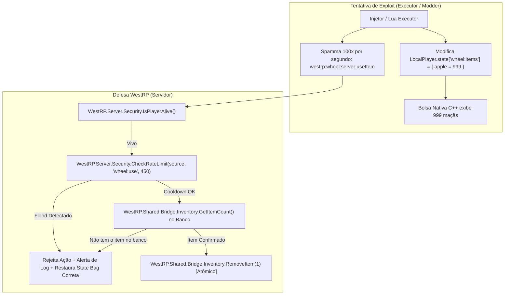

# Especificação Técnica & Plano de Execução: `westrp_wheel`

Sistema de Roda de Seleção Nativa de Itens e Provisões (*InputWheel / Quick Select*) desenvolvido para o ecossistema **WestRP**, baseado na engine Scaleform original do Red Dead Redemption 2 / RedM.

---

## 1. Segurança & Blindagem contra Exploits com State Bags

### A Resposta Direta
> **Ficaremos 100% protegidos contra exploits?**
> **SIM**, desde que a arquitetura respeite o princípio inegociável de **Autoridade Estrita do Servidor (*Server Authority*)**.

### Vetores de Ataque Analisados & Como Serão Neutralizados



1. **Tentativa de Injeção de Itens via State Bag (`set` no Client)**:
   - *Ataque*: Um trapaceiro altera via executor a sua própria State Bag `wheel:items` adicionando 999 tônicos ou itens caros.
   - *Efeito*: No cliente dele, os itens podem até aparecer visualmente na bolsa C++.
   - *Neutralização*: A State Bag do cliente é tratada pelo servidor como **estritamente descartável/visual**. O servidor **nunca consulta a State Bag para autorizar o consumo**. Toda autorização é feita via consulta atômica ao inventário real da bridge (`WestRP.Shared.Bridge.Inventory.GetItemCount`). O trapaceiro apenas vê um ícone; ao tentar usar, a ação é rejeitada e a State Bag é sobrescrita pelo servidor com o valor real.

2. **Tentativa de Packet Flooding / Spam de Consumo Instantâneo**:
   - *Ataque*: O trapaceiro spamma o evento `westrp:wheel:server:useItem` dezenas de vezes por segundo para ficar imortal recuperando vida ou estamina.
   - *Neutralização*: O endpoint do servidor é blindado com `WestRP.Server.Security.CheckRateLimit(source, 'wheel_use', 450)`. Requisições consecutivas com intervalo menor que o tempo de animação (450ms) são descartadas imediatamente com aviso no logger do core.

3. **Tentativa de Duplicação por Concorrência (Race Condition)**:
   - *Ataque*: Jogador tenta consumir um item pela roda exatamente no mesmo milissegundo em que passa o item para outro jogador ou baú.
   - *Neutralização*: Subtração atômica no banco de dados / VORP API antes de aplicar o efeito. Se `RemoveItem()` retornar `false`, o efeito de cura/alimento não é aplicado.

4. **Uso Indevido (Morto, Algemado ou Carregando Objeto)**:
   - *Ataque*: Consumir tônicos enquanto está derrubado ou rendido.
   - *Neutralização*: Verificação em dupla camada:
     - *Client*: `LocalPlayer.state['wheel:disabled']` impede a abertura da roda.
     - *Server*: `WestRP.Server.Security.IsPlayerAlive(source)` impede execução caso o cliente burle a interface.

---

## 2. Arquitetura de Módulos do `westrp_wheel`

```
resources/[westrp]/[systems]/westrp_wheel/
├── fxmanifest.lua
├── config.lua                      # Whitelist de itens, hashes RDR3 e slots
├── client/
│   ├── buffer_pool.lua             # Buffers binários estáticos (Zero GC)
│   ├── native_mirror.lua           # Manipulação C++ de GUIDs e satchel nativa
│   └── main.lua                    # Ciclo de vida, TickManager e Scaleform Hook
└── server/
    ├── sync_manager.lua            # Event-driven inventory sync (Zero Polling)
    └── main.lua                    # Endpoint seguro de consumo e rate-limit
```

---

## 3. Plano de Execução Estruturado (Tasks & Subtasks)

### FASE 1: Fundação & Infraestrutura (Zero GC & Config)

#### Task 1.1: Configuração do `fxmanifest.lua`
- [ ] Declarar `fx_version 'cerulean'` e `game 'rdr3'`.
- [ ] Ativar `lua54 'yes'`.
- [ ] Carregar `@westrp_core/init.lua` em `shared_scripts`.
- [ ] Declarar dependência formal de `westrp_core`.

#### Task 1.2: Dicionário de Configuração (`config.lua`)
- [ ] Mapear itens consumíveis, tônicos, provisões e itens de cavalo padrão do servidor.
- [ ] Configurar paridade: `[vorp_item_name] = { nativeHash = 'consumable_apple', slot = 'SLOTID_SATCHEL' }`.
- [ ] Traduzir todas as labels e notificações para PT-BR.
- [ ] Definir tempos de cooldown (`DefaultCooldownMs = 450`, `HoldThresholdMs = 180`).

#### Task 1.3: Módulo de Pool de Buffers Estáticos (`client/buffer_pool.lua`)
- [ ] Reutilizar a biblioteca `DataView` já inclusa no `westrp_core`.
- [ ] Pré-alocar **buffers estáticos singleton** para evitar alocação de memória e GC nos ticks:
  - `StaticGuidBuffer`: buffer de 32 bytes (`8 * 4`).
  - `StaticSlotBuffer`: buffer de 64 bytes (`8 * 8`).
  - `StaticItemInfoBuffer`: buffer de 104 bytes (`8 * 13`).
  - `StaticUIMessageBuffer`: buffer de 32 bytes (`8 * 4`).
- [ ] Criar funções de acesso rápido sem instanciação de novas tabelas.

---

### FASE 2: Motor Nativo do Cliente (Scaleform & Mirror Satchel)

#### Task 2.1: Gerenciamento da Satchel C++ (`client/native_mirror.lua`)
- [ ] Implementar `GetPlayerInventoryGUID()` com buffer estático.
- [ ] Implementar `ResolveItemSlotInfo(itemHash)` para mapear `SLOTID_SATCHEL` vs `SLOTID_ACTIVE_HORSE`.
- [ ] Implementar `AddItemToNativeInventory(itemHash, count)`.
- [ ] Implementar `RemoveItemFromNativeInventory(itemHash, count)`.
- [ ] Criar método otimizado `ApplySnapshot(newSnapshot)` que calcula a diferença delta entre o estado atual e o desejado, executando apenas as adições/remoções estritamente necessárias.
- [ ] Implementar `ClearNativeSatchel()` protegido com timeout para evitar bloqueio de thread no join/disconnect.

#### Task 2.2: Ciclo de Vida Reativo & TickManager (`client/main.lua`)
- [ ] Integrar ao `WestRP.Client.TickManager` com intervalo adaptativo:
  - **Estado Normal (Idle)**: Intervalo de 250ms (0.00ms no Resmon).
  - **Roda em Uso**: Intervalo de 0ms enquanto `IsUiappRunning("hud_quick_select")` for verdadeiro.
- [ ] Bloquear ativação caso `LocalPlayer.state['wheel:disabled']` seja `true`.
- [ ] Publicar no `LocalPlayer.state:set('isWheelOpen', true, false)` local para outros scripts consumirem.

#### Task 2.3: Interceptação das Abas e Seleção de Itens
- [ ] Drenar mensagens da UI com `EventsUiIsPending(`HUD_QUICK_SELECT`)` e `0xE24E957294241444` (`EVENTS_UI_GET_MESSAGE`).
- [ ] Monitorar mudança de abas pelos hashes:
  - `0x307DF156`: Aba 0 (Armas) $\rightarrow$ Permite que o jogo processe normalmente.
  - `0xE74EF76D`: Aba 1 (Provisões / Itens) $\rightarrow$ Ativa captura de item focado.
  - `0xA8422FCB`: Aba 2 (Cavalo) $\rightarrow$ Ativa captura de item focado.
- [ ] Capturar item destacado pelo analógico/mouse com `0x9C409BBC492CB5B1`.
- [ ] Detectar momento em que o jogador solta a roda com item selecionado e disparar o consumo seguro.

#### Task 2.4: Ouvinte Reativo de State Bag
- [ ] Registrar `AddStateBagChangeHandler('wheel:items', ...)` para o jogador local.
- [ ] Ao receber nova tabela do servidor, invocar `ApplySnapshot` imediatamente.

---

### FASE 3: Servidor Event-Driven & Hardening de Segurança (Zero Polling)

#### Task 3.1: Eliminação Total do Polling (`server/sync_manager.lua`)
- [ ] **Não implementar nenhum loop de `Wait(2000)`**.
- [ ] Escutar eventos nativos da Bridge do VORP / WestRP:
  - `vorp_inventory:Server:OnItemCreated`
  - `vorp_inventory:Server:OnItemRemoved`
  - `vorp_inventory:Server:OnItemTakenFromCustomInventory`
  - `vorp_inventory:Server:OnItemMovedToCustomInventory`
- [ ] Implementar fila de atualização (*Debounced Sync* de 150ms) para evitar rajada de pacotes durante transferência de múltiplos itens.

#### Task 3.2: Geração e Publicação do Compact Snapshot
- [ ] Filtrar estritamente os itens presentes na whitelist do `Config.WheelItems`.
- [ ] Gerar payload ultra-compacto: `{"consumable_apple": 2, "consumable_meat": 1}`.
- [ ] Atualizar o State Bag: `Player(source).state:set('wheel:items', compactSnapshot, true)`.

#### Task 3.3: Endpoint Seguro de Consumo (`server/main.lua`)
- [ ] Registrar evento de rede: `westrp:wheel:server:useItem(itemName)`.
- [ ] Validações de segurança:
  1. `WestRP.Server.Security.IsPlayerAlive(source)`
  2. `WestRP.Server.Security.CheckRateLimit(source, 'wheel_use', 450)`
  3. Checar se `Config.WheelItems[itemName]` existe.
  4. Checar via bridge se o jogador tem o item: `WestRP.Shared.Bridge.Inventory.GetItemCount(source, itemName) >= 1`.
- [ ] Executar remoção atômica no banco: `WestRP.Shared.Bridge.Inventory.RemoveItem(source, itemName, 1)`.
- [ ] Disparar o gatilho de uso oficial do inventário para que os efeitos do item (comer, beber, animar, recuperar stats) sejam executados nativamente.
- [ ] Atualizar a State Bag do jogador após a remoção.

#### Task 3.4: Triagem Inteligente de Itens Degradáveis
- [ ] Caso o item possua metadados de durabilidade/frescor, selecionar e consumir primeiro o item com menor porcentagem restante (FIFO por validade), evitando perda por apodrecimento.

---

### FASE 4: Harmonização com o Ecossistema WestRP

#### Task 4.1: Unificação com `westrp_ui/native_hud.lua`
- [ ] O `native_hud.lua` atualmente checa a tecla TAB via `IsControlPressed` para exibir a barra de Karma/Honra.
- [ ] Substituir o polling de tecla do `native_hud.lua` pela leitura de `IsUiappRunning("hud_quick_select")` ou pelo State Bag `LocalPlayer.state.isWheelOpen`, garantindo que a barra de honra e a roda abram em perfeita sincronia visual.

#### Task 4.2: Notificações Padronizadas
- [ ] Exibir toasts de uso através de `WestRP.Client.UI.ShowToast` ou usando a notificação nativa avançada de inventário (`FeedNotification` do RDR3), garantindo textos formatados em português.

#### Task 4.3: Limpeza de Ciclo de Vida
- [ ] No `onResourceStop` e `playerDropped`, descarregar todos os prompts, interromper tarefas do `TickManager` e limpar a Satchel nativa sem deixar resíduos.

---

### FASE 5: Testes, Auditoria & Homologação

#### Task 5.1: Testes de Stress e Anti-Dupe
- [ ] Testar consumo com 100 requisições simuladas via comando debug para validar se o `CheckRateLimit` bloqueia tentativas de duplicação.
- [ ] Testar troca rápida de itens entre baú/chão e consumo simultâneo.

#### Task 5.2: Perfilamento de Performance (Resmon)
- [ ] Confirmar resmon **0.00ms** com a roda fechada.
- [ ] Confirmar resmon **< 0.02ms** com a roda aberta e cursor girando.
- [ ] Confirmar zero uso de CPU no servidor em repouso.

#### Task 5.3: Testes de Borda
- [ ] Queda de conexão / Crash do FiveM: verificar se o jogador não carrega itens duplicados ao reconectar.
- [ ] Morte do jogador com a roda aberta: verificar se a roda fecha e os itens não são perdidos.

---

## 4. Matriz de Decisão Arquitetural

| Critério | `awz_inputwheel` Original | Novo `westrp_wheel` |
|---|---|---|
| **Fonte da Verdade** | Mista (Client requisita sincronização) | **100% Servidor (Server Authority)** |
| **Transporte de Dados** | Net Events manuais com polling de 2s | **State Bags nativos com dirty diff** |
| **Resmon Idle** | 0.01ms contínuo | **0.00ms (TickManager dinâmico)** |
| **Alocação de Memória** | Alta (Instancia buffers em todo frame) | **Zero GC (Buffer Pooling estático)** |
| **Proteção Anti-Cheat** | Zero proteção no servidor | **Rate-limit, Validação de Vida e Remoção Atômica** |
| **Acoplamento** | VORP puro (Italiano) | **WestRP Bridge SDK (PT-BR)** |

---

## 5. Banco de Dados & Registro de Itens (`items_wheel.sql`)

### Diagnóstico do `items.sql` Original do GitHub
No repositório original (`awz_inputwheel/items.sql`), o autor incluiu um script SQL com sérios riscos para servidores em produção:
1. **IDs Fixos e Hardcoded (`id` de 1 a 111)**: Como a tabela `items` do VORP utiliza chave primária com `AUTO_INCREMENT`, executar aquele script causa erro fatal de **chave primária duplicada (`Duplicate entry '1' for key 'PRIMARY'`)**, além do risco de corromper itens já existentes.
2. **Textos em Italiano**: Todas as labels e descrições originais estão em italiano (`'Mela'`, `'Fagioli'`, `'Conhaque di Qualità'`).
3. **Ausência de Cláusula de Conflito**: Um simples `INSERT INTO` causará crash na importação caso qualquer um dos itens (como `consumable_peach` ou `consumable_apple`) já esteja cadastrado no seu banco.

### Solução WestRP: `items_wheel.sql`
Criamos o arquivo oficial [`items_wheel.sql`](file:///c:/txData/VORPCore_B1A065.base/resources/%5Bwestrp%5D/%5Bsystems%5D/westrp_wheel/items_wheel.sql):
- **111 Itens Traduzidos**: Mapeados para PT-BR em paridade estrita com o [`config.lua`](file:///c:/txData/VORPCore_B1A065.base/resources/%5Bwestrp%5D/%5Bsystems%5D/westrp_wheel/config.lua).
- **Sem IDs Fixos**: A coluna `id` foi omitida, permitindo que o MySQL gere os IDs sequenciais corretos sem jamais colidir com itens do seu servidor.
- **Cláusula `INSERT IGNORE INTO`**: Se o seu servidor já possuir itens como `consumable_apple` ou `consumable_haycube`, eles **não serão duplicados nem corrompidos**. O MySQL inserirá apenas os itens que faltavam.

### Como Executar a Migração
1. Abra o seu gerenciador de banco de dados MySQL (HeidiSQL, DBeaver ou phpMyAdmin).
2. Selecione o banco de dados do seu servidor RedM (ex: `vorp_core` ou similar).
3. Abra e execute o arquivo:
   `resources/[westrp]/[systems]/westrp_wheel/items_wheel.sql`
4. Reinicie o recurso `vorp_inventory` ou o servidor para que o cache de itens do VORP recarregue as novas entradas.
